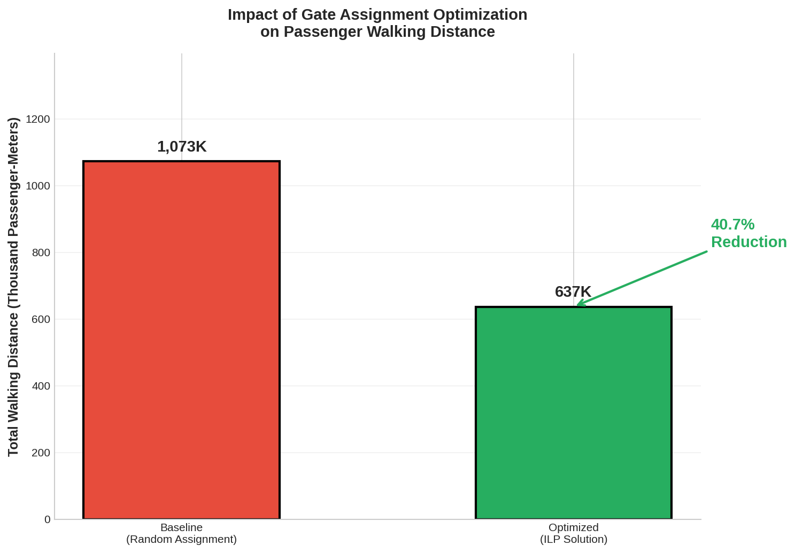
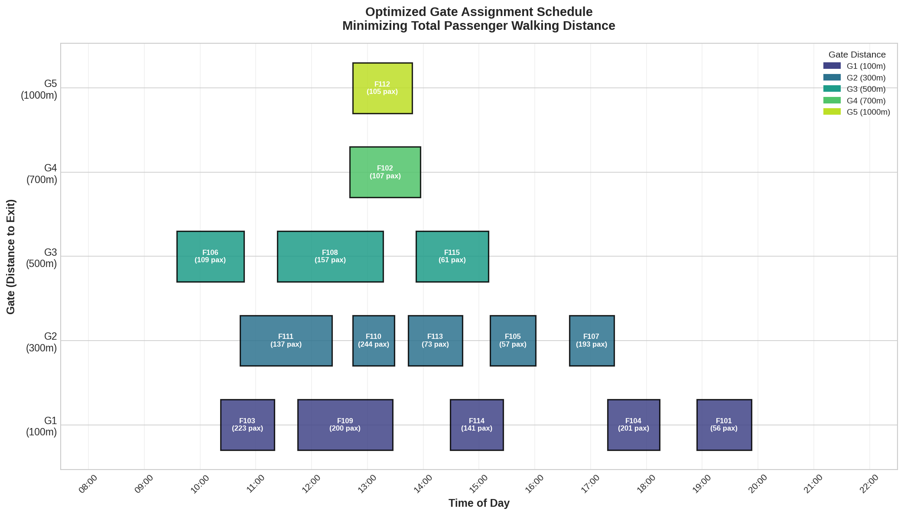
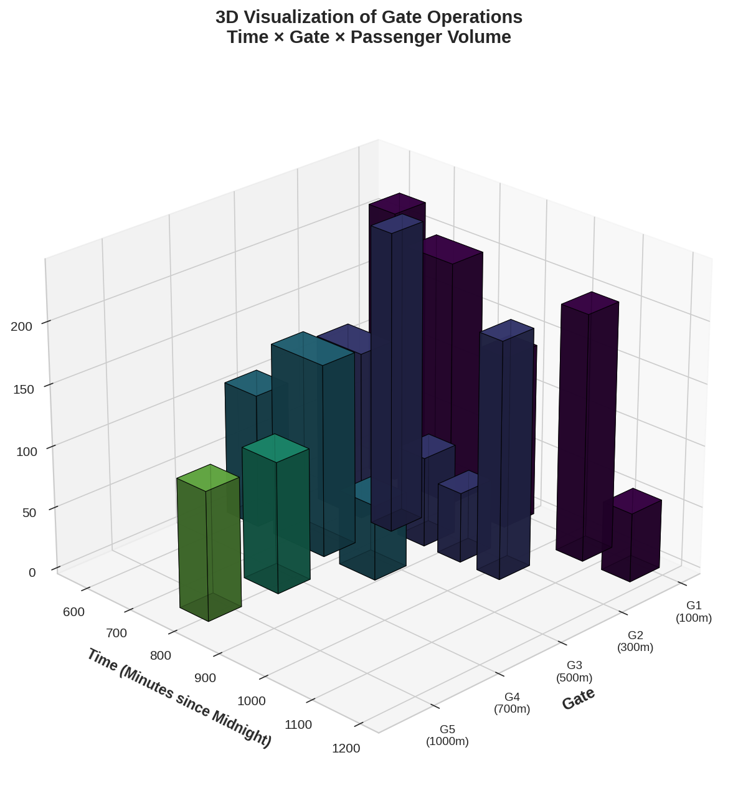

# Optimizing Airport Gate Allocation: An Integer Linear Programming Approach

## ✈️ Executive Summary
This project addresses the **Airport Gate Assignment Problem (AGAP)**, a critical logistical challenge in aviation management. By leveraging **Integer Linear Programming (ILP)**, we demonstrate a mathematical framework to optimize flight-to-gate assignments. The primary objective is to minimize total passenger walking distance while satisfying stringent operational constraints, such as gate availability and flight schedule overlaps.

**Key Findings:**
*   **Optimization Methodology:** Binary Integer Programming using the Branch-and-Cut algorithm.
*   **Performance Gain:** Achieved a **40.68% reduction** in total passenger walking distance compared to stochastic (random) assignment baselines.
*   **Operational Scalability:** Successfully resolved complex scheduling conflicts for a simulated high-density operational window.

---

## 📊 Performance Overview

| Metric | Baseline (Stochastic) | Optimized (ILP) | Delta (Improvement) |
| :--- | :--- | :--- | :--- |
| **Total Walking Distance** | 1,073,280 pax-m | 636,700 pax-m | **↓ 40.68%** |
| **Average Distance per Pax** | 536.6 m | 318.3 m | **↓ 218.3 m** |


*Figure 1: Comparison of total passenger walking distance between baseline and optimized scenarios.*

---

## 🧠 Mathematical Formulation

The problem is modeled as a discrete optimization task with the following components:

### 1. Decision Variables
Let $x_{i,j}$ be a binary decision variable such that:
$$
x_{i,j} = \begin{cases} 
1 & \text{if flight } i \text{ is assigned to gate } j \\
0 & \text{otherwise}
\end{cases}
$$

### 2. Objective Function
Minimize the global cost function $Z$, representing the total passenger-meters walked:
$$ \text{Minimize } Z = \sum_{i \in F} \sum_{j \in G} (x_{i,j} \cdot P_i \cdot D_j) $$
Where:
*   $P_i$: Number of passengers on flight $i$.
*   $D_j$: Distance from gate $j$ to the main airport terminal exit.

### 3. Operational Constraints
*   **Uniqueness Constraint:** Each flight $i$ must be assigned to exactly one gate $j$.
    $$ \sum_{j \in G} x_{i,j} = 1, \quad \forall i \in F $$
*   **Conflict Constraint:** For any two flights $(A, B)$ with overlapping schedules, they cannot occupy the same gate $j$ simultaneously.
    $$ x_{A,j} + x_{B,j} \le 1, \quad \forall j \in G, \forall (A, B) \in \text{Conflicts} $$

---

## 📈 Operational Insights

### Optimized Flight Schedule
The visualization below shows the gapless scheduling achieved by the solver. The system prioritizes high-capacity flights (darker bars) at gates with shorter terminal distances ($G1, G2$).


*Figure 2: Gantt chart depicting the optimized allocation of flights across available gates over time.*

### 3.D Volumetric Analysis
This chart visualizes the "operational pressure" on the gate system, combining time, gate ID, and passenger volume into a single 3D metric.


*Figure 3: 3D Visualization of Gate Operations (Time × Gate × Passenger Volume).*

---

## 🚀 Implementation & Reproducibility

### Repository Structure
*   `notebooks/Airport-Gate-Solver.ipynb`: Comprehensive notebook with step-by-step mathematical derivation and analysis.
*   `run_model.py`: Lightweight production script for running the optimization and generating core results.
*   `generate_readme_assets.py`: Advanced visualization suite used to generate academic-grade charts.
*   `images/` folder containing all high-resolution analytical visualizations.

### Installation
1.  **Clone the repository**
2.  **Initialize Environment:**
    ```bash
    python3 -m venv venv
    source venv/bin/activate
    pip install -r requirements.txt
    ```
3.  **Execute Analysis:**
    ```bash
    python3 run_model.py
    ```

---

## 🎓 Academic Context
This project was developed for academic purposes to demonstrate the application of **Operations Research** in transportation logistics. It showcases the transition from data-driven demand modeling to prescriptive analytics using industry-standard optimization solvers.
